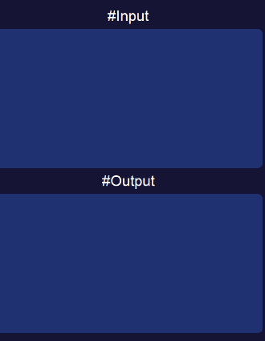
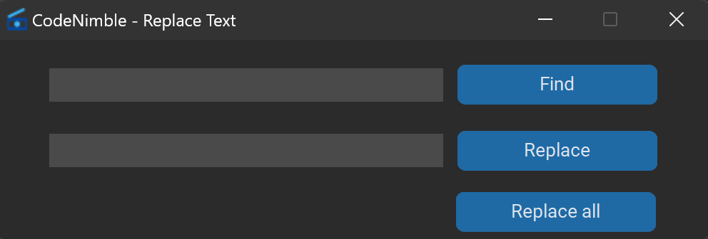

# CodeNimble
Code Nimble is a light code editor dedicated for competitive programming.

# Features

1. Autocompletion

- Autocomplete for: IF, WHILE, FOR, DO, CPP, INT, LONG
You need to type these keywords in textbox with CAPS and hit ENTER
- Autocomplete for: "", '', (), [], {}

2. You can save a file/folder and it will open when you reopen the app -> File -> Save as default file/Save as default folder

3. Input & Output

You can set 2 files for input & output e.g (input.in, output.out) and when you run the code the output will appear in the output textbox:

4. Treeview

Very useful for any occasion. It will be displaied when you open a folder from File -> Open Folder in the left of the window

5. Fast find & replace

6. Templates

- You can chose from a lot of templates: C++, C++ competitive, Java, C, HTML or you can create your own from Templates -> Create Template and use with Ctrl+Shift+T or with Templates -> Use Template.
- These templates work like this: you select a template and a new tab will appear in the file tab with the template content

7. RUN - you can run C++ files directly from the app by using Utility -> Run or with F5

8. Paint Mode - you no longer need to open paint to make schemes or drawings because this tool will do all the work, you can use it from Utility -> Paint Mode or Ctrl+P and is like a Paint App

9. Local Server

- Start Server -> you can host a server on you machine
- Join Local Server -> you can join a server
- Disconnect -> you can leave a server
- Server Panel -> you can see the server members

This feature is good for teams that code on a single file, when a user type in the textbox it will be updated for anyone that are connected to that server

10. C++ support and partial support for Python

- Code suggestion
- Code highlighted

# Images

# Change log

To see the full change log, check [CHANGELOG](CHANGELOG.md)

# Contributing

If you want to make contributions read [CONTRIBUTING](CONTRIBUTING.md)

# Build

If you want to build this project from the source read [BUILD](BUILD.md)
