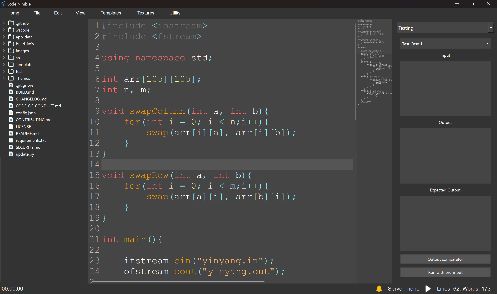

# CodeNimble
Code Nimble is a light code editor dedicated for competitive programming.

# Images

# Change log

To see the full change log, check [CHANGELOG](CHANGELOG.md)

# Contributing

If you want to make contributions read [CONTRIBUTING](CONTRIBUTING.md)

# Build

If you want to build this project from the source read [BUILD](BUILD.md)
